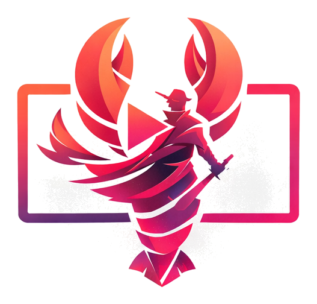

# 虾客漫 Xiakeman

<div align="center">
  
  <p><strong>把小说、剧本和故事想法，整理成角色、分镜、AI 图片和视频。</strong></p>
  <p>适合个人创作者和小团队在自己的电脑上使用。</p>
</div>

## 这是什么

虾客漫是一套源码公开的 AI 视频创作工作台。你可以从一段小说、剧本或故事梗概开始，逐步完成人物与场景整理、故事板、图片素材、视频片段和成片合成。

这个版本不附送模型额度，也不要求注册虾客漫账号。对话、图片、视频和语音服务由你自己选择并填写 API，项目默认保存在当前浏览器里。

## 能做什么

- 小说改编、剧本整理和分集设计
- 自动提取角色、场景、道具和分镜
- 生成人物参考图、场景图和故事板
- 批量生成视频片段并查看任务进度
- 添加原声、音效和 BGM，合成并导出成片
- 使用独立的图片工作台、视频工作台和节点画布
- 导入、导出项目，方便备份或换电脑继续制作

不同功能需要不同的模型服务。想先看看自己需要准备什么，可以阅读 [功能说明](docs/FEATURES.md)。

## 三步开始使用

### 1. 准备 Node.js

安装 [Node.js 20.19 或更高版本](https://nodejs.org/)。

### 2. 下载并启动

```powershell
git clone https://github.com/XiakeMan777/xiakeman-ai-short-drama.git
cd xiakeman-ai-short-drama
```

Windows 用户可以直接双击 `start.bat`。第一次启动会自动安装依赖，完成后打开：

```text
http://localhost:8022
```

也可以手动启动：

```powershell
npm ci
npm ci --prefix bff
Copy-Item .env.example .env
npm run dev:bff
```

再打开一个终端运行：

```powershell
npm run dev
```

### 3. 填写自己的 API

进入页面后，点击右上角的“API 设置”：

1. 先配置对话模型，用来改编、分析和生成提示词。
2. 需要 AI 出图时，再配置图片模型。
3. 需要生成视频时，选择并配置对应的视频服务。
4. 需要语音、音效或转写时，再补充语音服务。

建议先用低额度 Key 做一次小测试，确认连接正常后再批量生成。详细填写方法见 [API 配置指南](docs/API_CONFIGURATION.md)。

## 项目保存在哪里

项目和 API 设置默认保存在当前浏览器，不会自动同步到虾客漫服务器。请定期使用项目里的导出功能保存备份；清理浏览器数据、重装系统或更换浏览器，都可能让未导出的本地项目丢失。

API Key 会保存在当前浏览器中，不要在网吧、公共电脑或不可信设备上保存私人密钥。

## 常见问题

### 为什么点生成后提示没有 API Key？

社区版不包含共享密钥或免费额度，需要先在“API 设置”中填写你自己的服务。不同厂商的地址、模型名和返回格式可能不同，第一次请用小任务测试。

### 为什么主工作流配置好了，节点画布仍提示未配置？

主工作流和节点画布使用两套独立设置。进入画布后，再打开一次“画布设置”并选择对应的模型。

### 一定要安装 FFmpeg 吗？

只做文本、图片或调用外部视频 API 时不一定需要。合成成片、音视频转换和部分导出功能需要 FFmpeg 与 ffprobe。

### 为什么没有登录按钮？

这个社区版采用本地使用方式，不需要注册或登录。项目跨设备迁移请使用导入、导出功能。

### 在哪里反馈问题？

页面右上角保留了“交流群”入口，也可以在 GitHub 提交 Issue。提交问题时请说明操作步骤和报错信息，但不要公开 API Key、私人素材或账号信息。

### 会统计哪些数据？

项目保留 Google Analytics 页面访问统计，帮助维护者了解有多少人在使用。项目内容、模型配置和 API Key 不会作为统计内容主动发送。

## 更多说明

面向使用者：

- [功能说明](docs/FEATURES.md)
- [API 配置指南](docs/API_CONFIGURATION.md)
- [部署指南](docs/DEPLOYMENT.md)
- [使用前先了解](docs/KNOWN_LIMITATIONS.md)
- [版本说明](docs/RELEASE_NOTES.md)

面向开发者：

- [项目架构](docs/ARCHITECTURE.md)
- [BFF HTTP API](docs/HTTP_API.md)
- [参与贡献](CONTRIBUTING.md)
- [安全说明](SECURITY.md)

## 许可证

本项目使用 [PolyForm Noncommercial License 1.0.0](LICENSE)：允许在许可证范围内进行非商业使用、修改和再分发；任何商业使用都需要事先取得版权方单独的书面授权。

这是一份“源码公开、非商业授权”的软件许可证，不是 OSI 定义的开源许可证。第三方依赖仍使用各自的许可证；你调用的模型、上传的素材和生成的内容，也需要遵守对应服务商与素材来源的规则。
